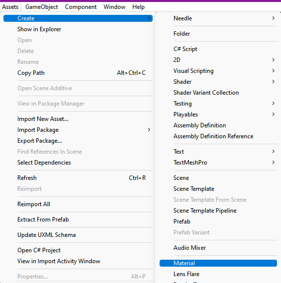
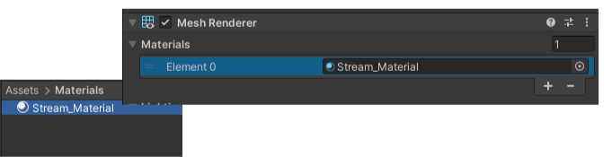
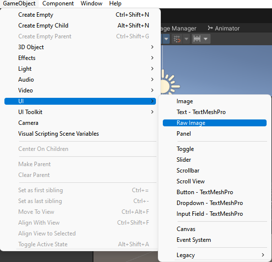
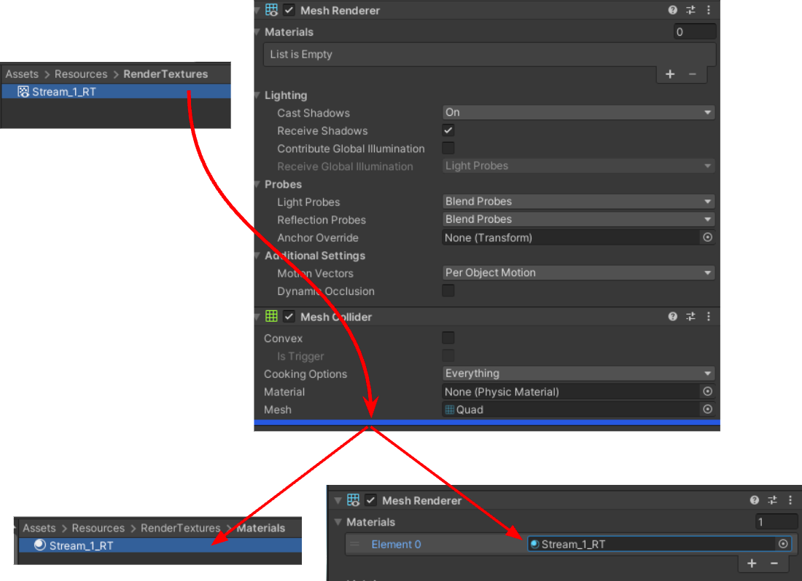
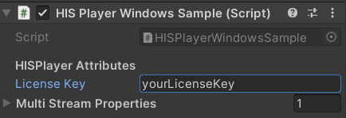
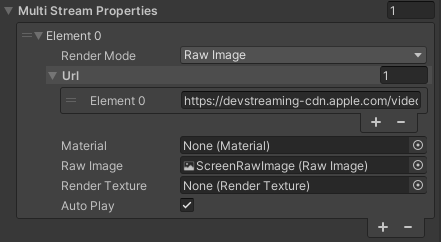
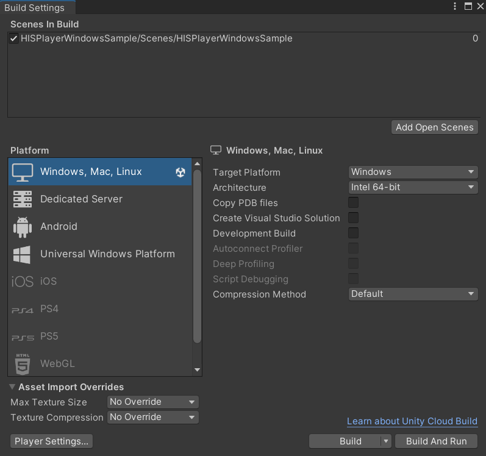

# Setup Guide
Through this guide, you will be introduced to the basic steps for setting up the playback.

## Import Package
Importing the package is the same as importing other normal packages in Unity. Select the package of HISPlayer SDK and import it.

**Assets > Import Package > Custom Package > HISPlayerWindowsSDK unity package**

<p align="center">

</p>

## Configure Unity for Windows
Switch the platform for **Windows**. Open **File > Build Settings** and then select **Windows, Mac, Linux platform** for Windows Standalone build or select **Universal Windows Platform** for UWP build and **switch platform**.

Open **Player Settings > Other Settings**. Disable the **Auto Graphics API for Windows** option and make sure that only **‘Direct3D11’** macro is defined.

### <ins>UWP Settings</ins>
Open **Universal Windows Platform Settings > Player Settings > Publishing Settings > Capabilities**. Check the **InternetClient** option to enable internet access.

## Setup HISPlayer Manager
Create a script which is going to inherit from **HISPlayerManager**. It is needed to include the namespace by adding **‘using HISPlayerAPI;’** and add this component to a GameObject. It is recommended to create an **Empty GameObject** for this.

Call the **‘SetUpPlayer()’** function in order to initialize the stream environment internally. This function can be called whenever it’s needed.

For example, using the Awake function:
```C#
using System.Collections;
using System.Collections.Generic;
using UnityEngine;
using HisPlayerAPI;

public class HISPlayerWindowsSample : HisPlayerManager
{
    protected override void Awake()
    {
        base.Awake();
        SetUpPlayer();
    }
}
```
It is strictly necessary to use **SetUpPlayer** before using anything else, because this function will initialize everything from the SDK in order to be able to use the rest of the functions (Play, Pause, Seek …).

## Attach Unity Resources
Move to **Unity Editor** to attach all the resources. The rendering system is supporting **Material, RawImage, RenderTexture** and **NONE** (empty)  Unity’s components.

### <ins>Material</ins>
Move into Assets’ folder to create a new **Material**. It is possible to create a new Material into **Assets > Create > Material**.

<p align="center">

</p>

Attach the material to the GameObject which is going to be used as a screen.

<p align="center">

</p>

### <ins>Raw Image</ins>
This action will be related to Unity’s Canvas. If there is not a Canvas created yet, creating a **Raw Image** will create one automatically. 
For the creation select, select **GameObject > UI > Raw Image**.

<p align="center">

</p>

Once it is created, it can be associated with the stream controller script without doing anything else.

### <ins>RenderTexture</ins>
First of all, check if the Resources folder exists and contains the RenderTextures folder. If it doesn’t exist then create it from zero. In this case, look for the Resources folder and copy its contents into the Unity Assets folder. This folder contains Unity RenderTexture resources. Another option is creating RenderTexture in Assets directly.

The **RenderTexture** has to be attached to the GameObject which will be a screen for rendering the multimedia stream.

For creating this object, select **GameObject > 3D Object > Quad**. Then select the GameObject and remove the material attached to its **Mesh Renderer** component, then replace it with the **RenderTexture** created. The **RenderTextures** folder provided by the SDK contains the **Material** folder and this material is the one which is needed to be used for the replacement . If the **RenderTexture** resource has been created from 0, then another option is to grab the **RenderTexture** from the **Assets** folder and drop it at the end of the GameObject’s Inspector, this will create a new material automatically.

<p align="center">

</p>

Once all this process it’s done, it’s time to associate the RenderTexture to the script component.

## Configure HISPlayer Properties

### <ins>License Key</ins>
Input the license key that is associated with the SDK. If the license key is not valid, the player won't work and will throw an error message.

License key is not required for HoloLens SDK.

<p align="center">

</p>


### <ins>Multi Stream Properties</ins>
Use **Multi Stream Properties** to set all configurations needed for multi stream.However, currently HISPlayer Windows SDK only supports single stream. Multi stream support will be added in the future. It starts with 0 elements. Adding more elements will be ignored until multi stream support is added. Each element added has its own configuration.
* <span style="color:blue">**Render Mode**</span>: Select the render surface. It can be RenderTexture, Material, RawImage or NONE.
* <span style="color:blue">**Material**</span>: Attach the **Material** asset created to the **Material** section of the element.
* <span style="color:blue">**Raw Image**</span>: Attach the **RawImage** asset created to the **RawImage** section of the element.
* <span style="color:blue">**Render Texture**</span>: Attach the **RenderTexture** to the **RenderTexture** section of the element.
* <span style="color:blue">**URL**</span>: Add the URL associated to the stream. Currently only single URL is supported.
* <span style="color:blue">**Autoplay**</span>: Property to determine whether the player will start automatically after set up.
<p align="center">

</p>

## Build and Run
Once the configuration it’s done, open **‘Build Settings’** and press **‘Build And Run’**.
<p align="center">

</p>
