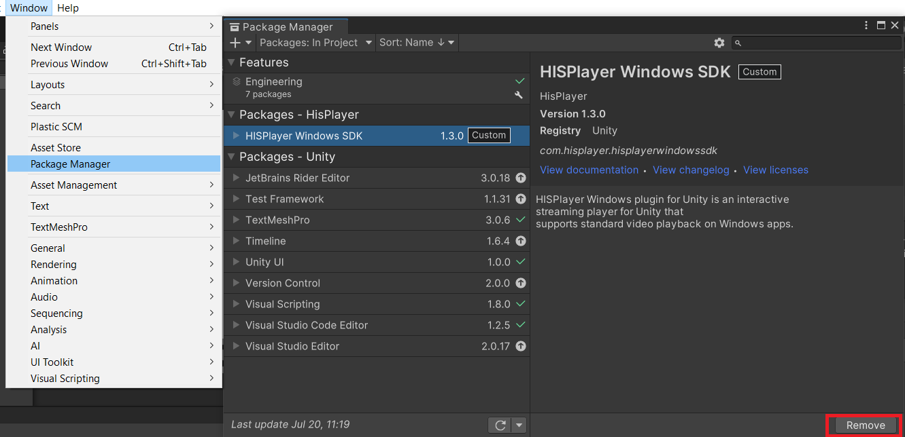

# Update the SDK

Through this guide, you will be introduced how to update the SDK if you already have installed the SDK previously.

## Remove Old Package

Remove the previous HISPlayer Windows SDK package from Unity Package Manager

**Window > Package Manager > Packages - HISPlayer > HISPlayer Windows SDK > Remove**

 

## Import New package

Importing the new package is the same as importing other normal packages in Unity. 
Select the package of HISPlayer SDK and import it.

**Assets > Import Package > Custom Package > HISPlayerWindowsSDK unity package**

 

## Configure Unity for Windows
Switch the platform for **Windows**. Open **File > Build Settings** and then select **Windows, Mac, Linux platform** for Windows Standalone build or select **Universal Windows Platform** for UWP build and **switch platform**.

Open **Player Settings > Other Settings**. Disable the **Auto Graphics API for Windows** option and make sure that only **‘Direct3D11’** macro is defined.

### <ins>UWP Settings</ins>
Open **Universal Windows Platform Settings > Player Settings > Publishing Settings > Capabilities**. Check the **InternetClient** option to enable internet access.

## Update License Key
Input the license key that is associated with the SDK through HISPlayer properties. If the license key is not valid, the player won't work and will throw an error message.

License key is not required for HoloLens SDK.

